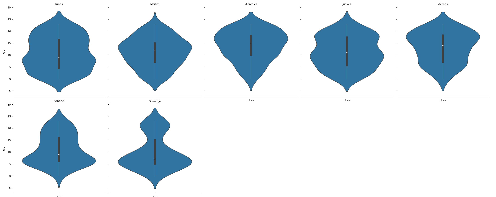

# PROYECTO DATA ANALYST -SINIESTROS VIALES

# INTRODUCCIÓN

En este trabajo se realiza un análisis de datos de los siniestros viales de la Ciudad Autónoma de Buenos Aires en el periodo 2016 a finales del 2021. Se realiza un proceso de transformación de los datos para que estos sean explorados de manera exhaustiva en el procesos de análisis exploratoratorio de estos datos.

De esta manera se encuentran hallazgos de importancia los cuales nos llevarán a conclusiones sobre este tema tan delicado como los homicidios en siniestros viales para posteriormente dar recomendaciones para disminuir las cifras de víctimas.

Estos hallazgos serán presentados en un dashboard interactivo en la plataforma Power Bi no solo para su presentación sino para que otros usuarios puedan acceder y poder ver toda la información y no solo los hallazgos.

# DESARROLLO

A continuación se realizara una descripción del desarrollo llevado a cabo de todo el proceso del trabajo, la parte de código y lo más específico se puede encontra en el archivo mencionado en cada etapa y solo se brindará un resumen de las mismas.

## ETL

En primer lugar se realizará un proceso de ETL donde se descargará la información y se transformará para dejar un dataset limpio y con la información para realizar el EDA de manera eficiente.

En este caso se utiliza como fuente principal de información el archivo <em>homiciodios.xlsx</em>, que se encuentra dentro de la carpeta Datasets, el cual se descargo del sitio de <a href="https://data.buenosaires.gob.ar/dataset/victimas-siniestros-viales">Buenos Aires Data</a>, el cual contiene la información del periodo 2016-2021 de homicidios en siniestros viales en la Ciudad Autónoma de Buenos Aires.

Este documento cuenta con información de los hechos y de las víctimas en diferentes hojas del archivo por lo que se decide unificar esta información y tratarla como un solo dataframe

Luego se procede a quedarse con información relevante para el análisis de la situación y se procede a dar formato y normalizar todo para su posterior tratamiento.

La información que se considera importante para este proyecto es:
<ul>
<li>Cantidad de victimas del siniestro.
<li>Fecha y hora en la que ocurrió.
<li>Lugar de donde ocurre el hecho.
<li>Tipo de calle donde se da el accidente.
<li>Comuna donde tuvo lugar el siniestro.
<li>Longitud y latitud del lugar.
<li>Los involucrados.
<li>La víctima del homicidio.
<li>El acusado del accidente aunque no lo fuera legalmente.
<li>El rol que tenía la víctima en el homicidio.
<li>El sexo de la víctima.
<li>La edad de la víctima
</ul>

 

Con todos estos datos se genera un archivo llamado <em>data.xlsx</em> que se encuentra en la carpeta Datasets y se utilizará para el análisis exploratorio de los datos.

## EDA

En el proceso de análisis exploratorio de datos se va a hacer hincapié en la imputación de datos y en los criterios tomados para realizar las mismas, además de los criterios para llevar a cabo otros análisis. Se trabajará aqui con el archivo <em>data.xlsx</em>.

Lo primeros que se hace en esta etapa es convertir los valores <strong>SD</strong> a nulos para poder estudiar el dataframe de manera normalizada y poder ver la cantidad de datos faltantes en el dataset. Aclaramos que si bien muchas veces es más mejor por cuestiones costo-beneficio borrar filas con datos faltantes que llevar a cabo un análisis para lograr una buena imputación de datos, en este caso se hace énfasis en la imputación de datos para hacer uso de esta herramienta.

Para la imputación de los valores faltantes en general la idea es no modificar la distribución de datos de la variable en la que hay valores nulos.

En el caso que falten pocos datos y haya clases de la variable en cuestión que tengan una mayor frecuencia se le imputan los datos faltantes a esa clase, ya que esta imputación no modificará de manera significativa la ditribución de los mismos. Como por ejemplo en las variables <em>sexo</em> donde mayoritariamente son HOMBRES o en el caso de <em>víctimas</em> donde la mayoria son MOTOS.

Cuando la cantidad de datos faltantes ya es importante lo que se hace es verificar si la imputación por algún valor no modifica la distribuciónde. Los metodos que se pueden ver en el notebook son imputación por la mediana, la media, la moda y mediante un muestreo por un método de la librería Pandas de Python.

Una vez hecha la imputación de valores faltantes se verifica que las distribuciones no se modifican y se elige la opción más idonea.

En lo que respecta a los valores atípicos en este set de datos solo se han registrado en una situación en particular pero se verá esto en los hallazgos.

En el proceso de análisis, se comienza con cada variables en particular para buscar patrones y luego se continua con las ventanas de tiempo típicos como trimestre, semestre, mes y semana.

También se analizan las horas en la que suceden los siniestros para ver patrones en días laborales y no laborales.

Una vez completado el EDA se crea un nuevo dataset, <em>data_final.xlsx</em> para ser utilizado con Power Bi y poder hacer la presentación del análisis realizado en esta sección.

# POWER BI

Con el archivo <em>data_final</em> se crea el dashboard interactivo en Power Bi que tiene el nombre <strong>Dashboard_PI</strong> y donde se puede consultar la información mediante filtros y gráficas para su fácil visualización, además de tener KPI's en base a los datos.

# KPI's

# HALLAZGOS

A continuación se presentarán los hallazgos encontrados en el análisis de datos para luego llegar a las conclusiones.

Como se puede ver en la imagen de arriba la mayoría de los accidentes se dan en la franja horaria comprendidad aproximadamente entre las 5:00 y las 12:00 horas. Sin embargo hay otra franja horaria que no hay que descartar que es entre las 15:00 y las 20:00 horas.

Se observa en la imagen como la gran cantidad de víctimas son personas que utilizan motos y peatones, estas dos categorías suman poco mas del 77% del total de las víctimas.

Podemos ver en el histograma que el 81.79% de las victimas se encuentra en lo que se conoce como población potencialmente activa que esta en el rango etario de 15 a 64 años segun <a href="https://www.argentina.gob.ar/pais/poblacion/proyecciones">información oficial</a>.

Casi un 77% de las víctimas son del sexo masculino, por lo que esta clase es altamente preponderante en lo que se refiere a víctimas.

Si bien en el gráfico de barras se puede ver una disminución de la cantidad de siniestros en el periodo 2016 - 2021, en el gráfico que sigue podemos ver una regresión lineal con una linea de color naranja y los maximos de cada año en color celeste.

 

En este gráfico verificamos que la tendencia es hacia la baja en la cantidad de victimas por año.

En el gráfico anterior se ven los periodos típicos de análisis, donde a medida que la ventana temporal se hace más pequeña la mayor cantidad de víctimas se da al final del año. Poríamos decir que el último bimestre del año es el de mayor cantidad de víctimas en términos general.

Es importante ver la distribución de la cantidad de víctimas a lo largo de las horas en los diferentes dias de la semana.

En días laborales los la mayor cantidad de victimas se dan en horarios laborales o al regresar del trabajo, esto último se hace más evidente los viernes.

Los fines de semana la distribución cambia y es muy similar <strong>Sabados</strong> y <strong>Domingos</strong> en donde la mayor cantidad de victimas se da por la madrugada-mañana lo que sería alrededor de las 5:00 horas.

Si bien se analizado las víctimas y los acusados por separado, a la hora de ver los involucrados en los accidentes tenemos que una preponderancia de 4 tipos de siniestros mas comunes siendo el primero la víctima y el segundo el acusado.

Los siniestros <strong>PEATON-PASAJEROS</strong>, <strong>MOTO-AUTO</strong>, <strong>MOTO-CARGAS</strong> y <strong>PEATON-AUTO</strong> son de los mas comunes representando alrededor del 40% de los tipos de siniestros.

Si revisamos a simple vista el gráfico anterior podemos ver como en lineas generales las víctimas de todo tipo tiene una tendencia en la baja de la cantidad de siniestros excepto la categoría <strong>BICICLETA</strong> que ha aumentado en los últimos 3 años.

Es importante remarcar que la categoría <strong>MOTO</strong> el último año tuvo un repunte.

Como se puede ver en el gráfico de arriba si bien la tendencia es a la baja de víctimas de siniestros, en los ultimos 3 semestres parece haber un repunte para luego volver a disminuir un poco el último semestre.

Si observamos las variaciones interanuales podemos ver un brusco descenso en el año 2019 y si bien siguió descendiendo en el 2020 este descenso fue menor y llegamos al año 2021 con un aumento relativo de la cantidad de víctimas.

Es importante destacar las primeras 5 comunas que registran más del 50% de las víctimas.

La mayor cantidad de siniestros que terminan con víctimas fatales se dan en las <em>avenidas</em>, cuyo límite de velocidad es de 60 km/hr según <a href="https://www.argentina.gob.ar/transito/consejos-para-circular#:~:text=Velocidades%20permitidas,nivel%3A%2020%20km%2Fh">información oficial</a>

Y como podemos ver también en la cantidad de víctimas por tipo de calle y donde diferenciamos el tipo de victima, en las avenidas la mayor cantidad es <strong>MOTO</strong> y <strong>PEATON</strong>.

Podemos observar como la mayor concentración de siniestros se dió al este de la Ciudad Autónoma de Buenos Aires.

# CONCLUSIONES

# RECOMENDACIONES

# TECNOLOGÍAS